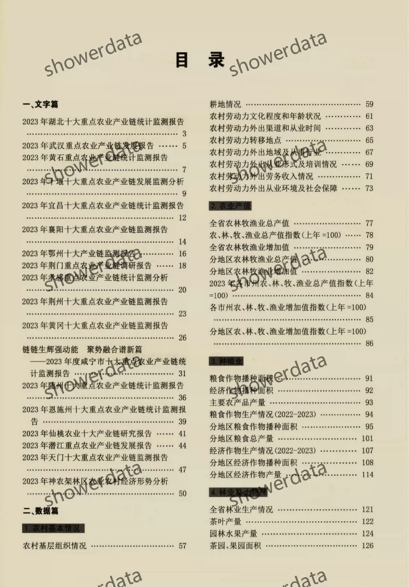
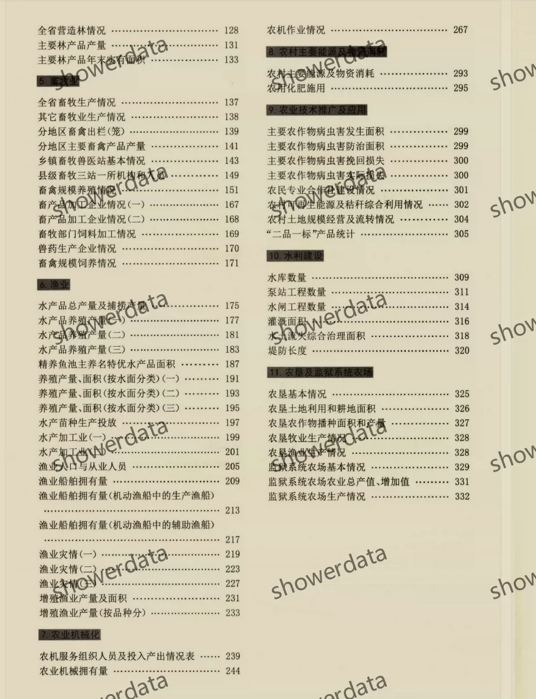

## Body

《Hubei Rural Statistical Yearbook》（1991-2025）

Data Year: The yearbook covers the years from 1983 to 2025. (The yearbook records historical statistics, so the data year is one less than the yearbook year, and some may be earlier.)
All are original yearbooks, not panel data compiled neatly! Please read carefully before purchasing, and pre-sale refunds or exchanges are not available.

01. Data Introduction
"Hubei Rural Statistical Yearbook"

02. Indicator Details
The directory is displayed in the picture for reference. Due to the limited space of the picture, it cannot display all information. The actual content of the yearbook should be referred to, please view on your own, consider buying accordingly, and do not help find data; all information is here. After shipment, unreasonable returns are not supported.
The display directory is for 2024, for reference only. Different statistical口径 may change over different years. Academic common sense, please note.

03. Data Format
Format: PDF

## Images

Here is a pay link on Stripe ( https://buy.stripe.com/3cs8yP7sY87d0vu9AB ). Please contact me lonlonago@foxmail.com after funding $89, and I will send you a complete data files , thank you!

